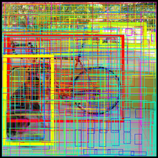

# YOLO-introduction

Object detection is one of the classical problems in computer vision:

Recognize what the objects are inside a given image and also where they are in the image.

Detection is a more complex problem than classification, which can also recognize objects but doesn’t tell you exactly where the object is located in the image — and it won’t work for images that contain more than one object.
 

YOLO is a clever neural network for doing object detection in real-time.

In this blog post I’ll describe what it took to get the “tiny” version of YOLOv2 running on iOS using Metal Performance Shaders.

Before you continue, make sure to watch the awesome YOLOv2 trailer. 😎

How YOLO works

You can take a classifier like VGGNet or Inception and turn it into an object detector by sliding a small window across the image. At each step you run the classifier to get a prediction of what sort of object is inside the current window. Using a sliding window gives several hundred or thousand predictions for that image, but you only keep the ones the classifier is the most certain about.

This approach works but it’s obviously going to be very slow, since you need to run the classifier many times. A slightly more efficient approach is to first predict which parts of the image contain interesting information — so-called region proposals — and then run the classifier only on these regions. The classifier has to do less work than with the sliding windows but still gets run many times over.

YOLO takes a completely different approach. It’s not a traditional classifier that is repurposed to be an object detector. YOLO actually looks at the image just once (hence its name: You Only Look Once) but in a clever way.

YOLO divides up the image into a grid of 13 by 13 cells:

Each of these cells is responsible for predicting 5 bounding boxes. A bounding box describes the rectangle that encloses an object.

YOLO also outputs a confidence score that tells us how certain it is that the predicted bounding box actually encloses some object. This score doesn’t say anything about what kind of object is in the box, just if the shape of the box is any good.

The predicted bounding boxes may look something like the following (the higher the confidence score, the fatter the box is drawn):

For each bounding box, the cell also predicts a class. This works just like a classifier: it gives a probability distribution over all the possible classes. The version of YOLO we’re using is trained on the PASCAL VOC dataset, which can detect 20 different classes such as:

    bicycle
    boat
    car
    cat
    dog
    person
    and so on…

The confidence score for the bounding box and the class prediction are combined into one final score that tells us the probability that this bounding box contains a specific type of object. For example, the big fat yellow box on the left is 85% sure it contains the object “dog”:

Since there are 13×13 = 169 grid cells and each cell predicts 5 bounding boxes, we end up with 845 bounding boxes in total. It turns out that most of these boxes will have very low confidence scores, so we only keep the boxes whose final score is 30% or more (you can change this threshold depending on how accurate you want the detector to be).

The final prediction is then:

From the 845 total bounding boxes we only kept these three because they gave the best results. But note that even though there were 845 separate predictions, they were all made at the same time — the neural network just ran once. And that’s why YOLO is so powerful and fast.

